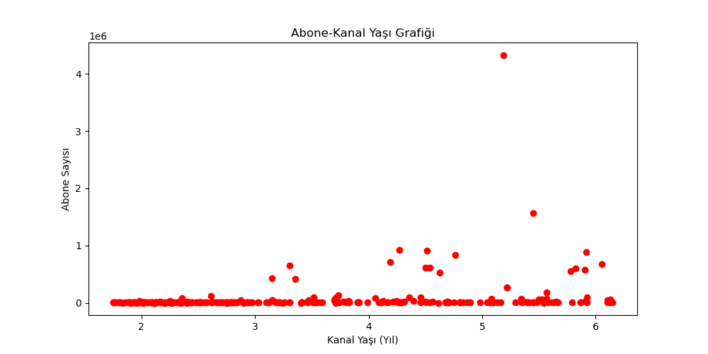
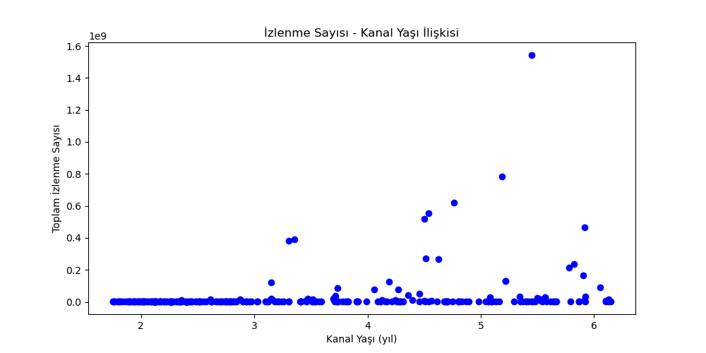
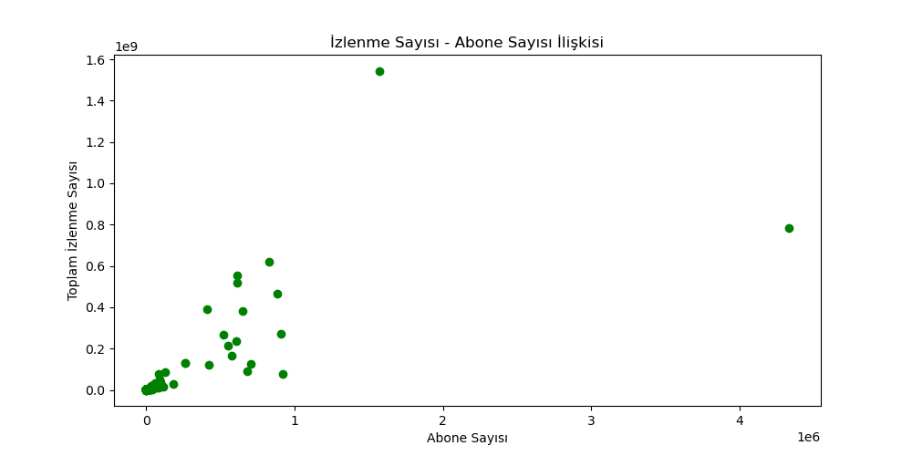
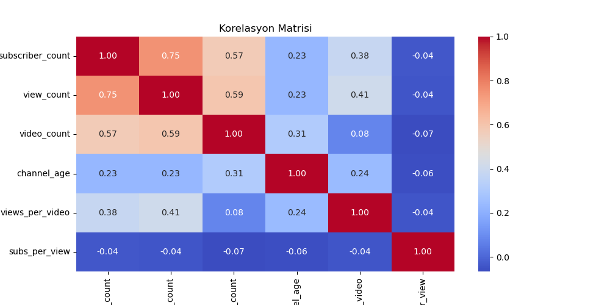

# 📊 SportsChannel Veri Analizi

Bu proje, YouTube’da yayın yapan spor kanallarına ait istatistikleri analiz ederek **kanal büyümesi, izlenme davranışları ve performans metrikleri** üzerine anlamlı çıkarımlar üretmeyi amaçlar.

Veri seti her kanal için aşağıdaki bilgileri içerir:

- Abone sayısı
- Toplam izlenme sayısı
- Video sayısı
- Kanal açılış tarihi
- Video başına ortalama izlenme
- İzlenme başına abone oranı

Proje, veri temizleme → veri dönüştürme → görselleştirme adımlarını içeren uçtan uca bir analiz süreci sunar.

---

## 🚀 Proje İçeriği

### 🔧 Veri İşleme Adımları

- Eksik değerlerin tespiti ve temizlenmesi  
- `start_date` değerlerinin datetime formatına dönüştürülmesi  
- Kanal yaşı (`channel_age`) hesaplanması  
- Yeni metriklerin türetilmesi:
  - `views_per_video`
  - `subs_per_view`
- Korelasyon matrisi oluşturulması  

---

## 📈 Üretilen Grafikler

Tüm grafik dosyaları **images/** klasöründe saklanmaktadır:

### Abone Sayısı – Kanal Yaşı

### İzlenme Sayısı – Kanal Yaşı

### Abone Sayısı – İzlenme Sayısı

### Korelasyon Matrisi

---

## 🛠 Kullanılan Teknolojiler

- Python 3  
- Pandas  
- Matplotlib  
- Seaborn  

---

## 🎯 Projenin Amacı

Bu proje, veri analizi ve veri görselleştirme yeteneklerini geliştirmek ve YouTube kanal performans dinamiklerini incelemek amacıyla hazırlanmıştır.  
Aynı zamanda portföyde sergilenebilecek profesyonel bir analiz örneği sunar.

---

